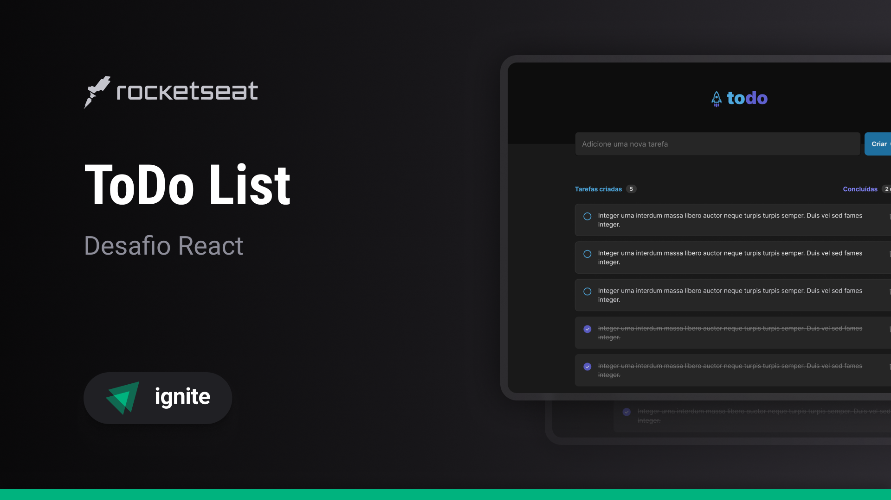

<h1 align="center">
    <br>
    
</h1>

<h4 align="center">
    Challenge React
</h4>

<p align="center">
    
    
    
</p>

<h1 align="center">
    
</h1>

# ToDo List 
ToDo List é uma página web para criação e controle de tarefas, que contém as seguintes funcionalidades:

- Adicionar uma nova tarefa
- Marcar e desmarcar uma tarefa como concluída
- Remover uma tarefa da listagem
- Mostrar o progresso de conclusão das tarefas

Nesse desafio busco reforçar meus conhecimentos sobre os conceitos mais importantes do ReactJS.

- Estados
- Imutabilidade do estado
- Listas e chaves no ReactJS
- Propriedades
- Componentização

## 🛠️ Tecnologias

Esse projeto foi desenvolvido com as seguintes tecnologias:

- CSS Modules
- [Vite](https://vitejs.dev/)
- [TypeScript](https://www.typescriptlang.org/)

## 🚀 Como executar

Clone o projeto e acesse a pasta do mesmo.

```bash
$ git clone https://github.com/pejamp/todo-ignite-challenge
$ cd todo-ignite-challenge
```

Para iniciá-lo, siga os passos abaixo:
```bash
# Instalar as dependências
$ npm install

# Iniciar o projeto
$ npm run dev
```

## 🌐 Projeto

- [Deploy](https://todo-ignite-challenge-pedrojrodrigues.vercel.app/)

## 👨‍💻 Autor

<a href="https://github.com/pejamp">
 
 <br />
 <sub><b>Pedro Rodrigues</b></sub>
</a> 
<a href="https://github.com/pejamp"></a>
<br />

## Contact me!

[](https://www.linkedin.com/in/pedro-rodrigues-3a3647176/)
[](mailto:pedro.roguea@gmail.com)
